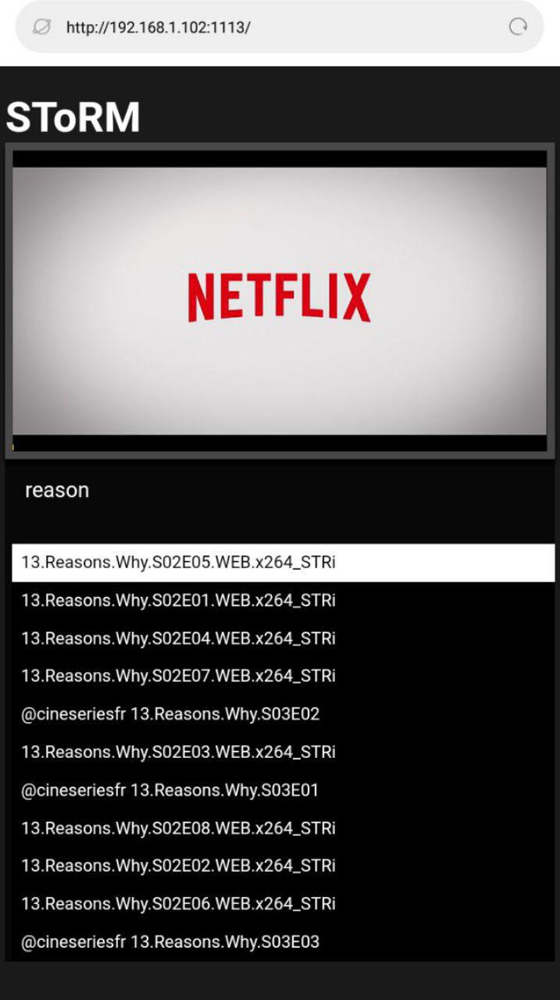
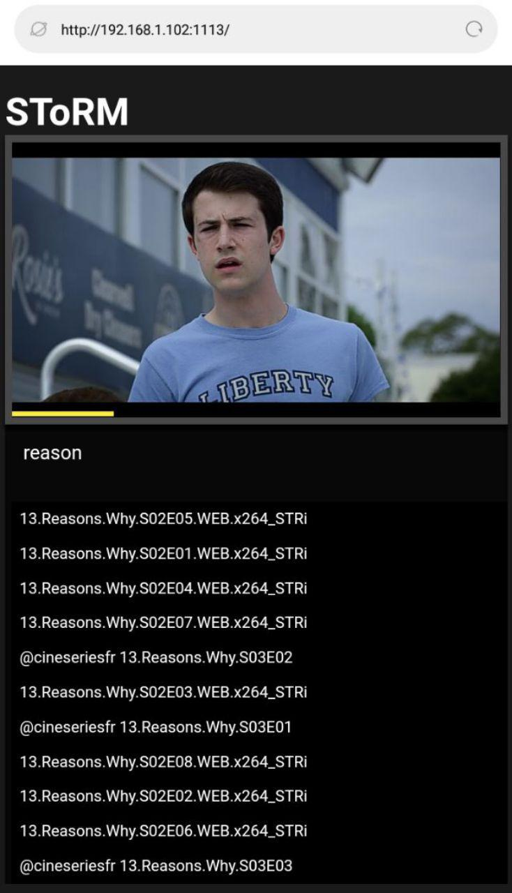
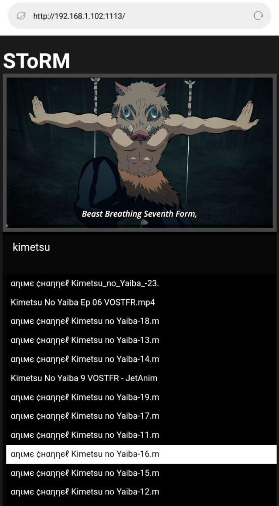
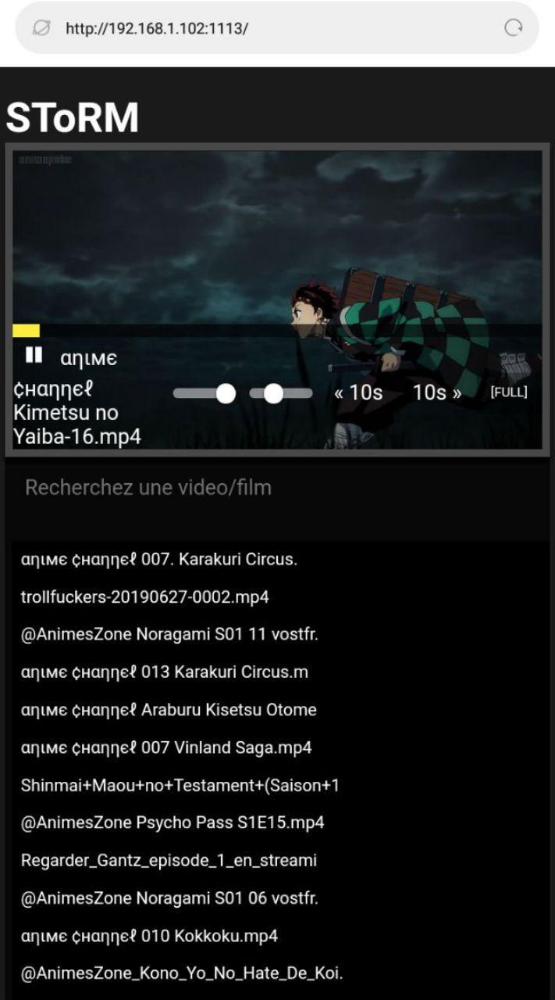
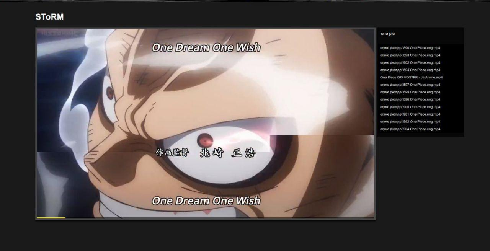

# SToRM

Stream your local videos/films/series in a LAN network (accessible from your mobile or anyone want to watch movies saved in your computer).

## Why you need Storm

This might not be obvious at first glance, but sometimes we are in a public environment and we would like to kill time watching a movie or serie that we have in our PC without necessarily wanting to take our PC bag A the view of everyone, I created Storm to manage only this small problem, it allows you to stream your movies / series directly on all your local network (Your mobile, etc ...) so you have access to your movies , etc. without having to install any tool for the client.

## Requirements

- Python (3.x is recommended)
- flask
- pathlib

## How it's work

A local server is loaded in your computer with all directory you have series, films or movies, you just need to configurated them in `path_dirs.json` and it's done.


## Install

To install all requirements, you have to hit this command line:
```shell
pip install -r requirements.txt
```

## Launch

Start Storm by hitting:

```shell
python main.py

# NOTE : Your Storm server is now running, you can check it on  http://127.0.0.1:1113/
# if you want to open this port in a Local Network just hit his in plus : sudo ufw allow 1113
# Of Course this is a Linux solution

```

Then share your IP address with others

## Screenshots

<table>
    <tr>
        <td>
            
        </td>
        <td>
            
        </td>
        <td>
            
        </td>
        <td>
            
        </td>
    </tr>
    <tr>
        <td colspan="4">
            
        </td>
    </tr>
</table>

## Author

- Sanix-darker